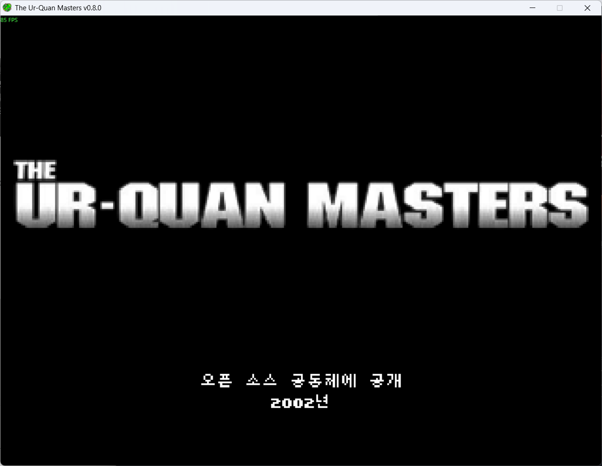
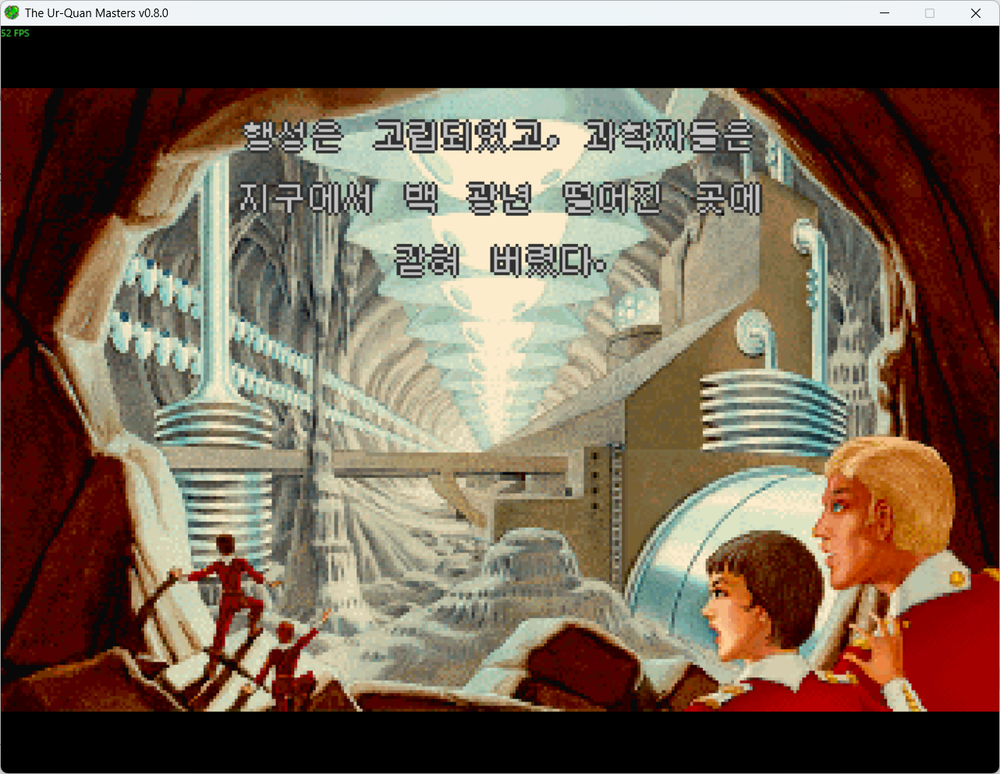
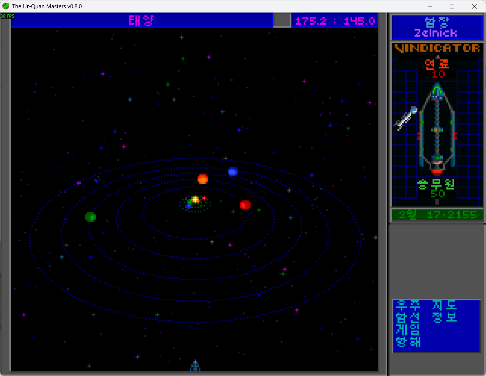

# Ur-Quan Masters 한국어 패치

**v1.0.2 — Steam판 Free Stars: The Ur-Quan Masters 0.8.0 한국어 패치**입니다.
대화, 설정, 공통 UI, 선택지와 대화 로그를 번역하고 종족별로 서로 다른 한글 글꼴과 말투를 적용했습니다.
이후 수정은 실제 플레이 피드백을 바탕으로 진행합니다. 비공식 팬 프로젝트입니다.

이 패치는 **아스트라(Astra)를 사용해 번역**했습니다. 전체 플레이 검수는 진행 중이며, 오역이나 문맥에 맞지 않는 표현은 플레이 피드백을 받아 수정합니다.

## 다운로드

[최신 배포판 다운로드](https://github.com/rodpold/ur-quan-masters-korean/releases/latest)

> **설치 전 확인 — Steam 재시작이 필요합니다.**
> 패치 프로그램이 이 게임의 **Steam 실행 옵션을 자동으로 등록**합니다. 처음 연결할 때는 Steam 메뉴의 **종료(끝내기)**로 완전히 종료한 뒤, 연결을 마치고 Steam을 다시 켜 주세요.
> 연결 후에는 평소처럼 **플레이**만 누르면 됩니다. 게임을 실행할 때마다 Steam을 재시작할 필요는 없습니다.

Releases의 **Assets → `uqm-korean-1.0.2-windows-x64.zip`**을 받으세요.
Windows 10/11 64비트용이며 Python을 따로 설치할 필요가 없습니다.
`Source code`와 `uqm-korean-1.0.2-source.zip`은 개발자용 소스입니다.
게임은 포함되어 있지 않으므로 Steam에서 먼저 설치해야 합니다.

## 한글화 스크린샷

한국어 패치를 적용한 실제 게임 화면입니다.

### 타이틀 화면



### 도입부 이야기



### 태양계 항해와 인터페이스



## 설치

1. 게임을 저장하고 완전히 종료합니다.
2. 받은 ZIP을 게임 폴더와 다른 쓰기 가능한 폴더에 **전체 압축 해제**합니다.
3. `UQM-Korean-Patcher.exe`를 실행합니다. `_internal` 폴더도 함께 있어야 합니다.
4. 표시된 Steam 게임 폴더가 맞으면 Enter를 누릅니다. 다르면 `uqm.exe`가 있는 폴더 경로를 입력합니다.
5. 메뉴에서 **1 설치 / 업데이트**를 입력하고 완료 메시지가 나올 때까지 기다립니다. 한글 이미지를 만드는 데 시간이 걸릴 수 있습니다.
6. 설치 후 안내에 따라 **Steam 메뉴 → 종료(끝내기)**로 Steam을 완전히 종료하고 Enter를 누릅니다. 창의 X 버튼만 누르면 Steam이 계속 실행될 수 있습니다.
7. 연결 완료 메시지가 나오면 Steam을 다시 열고 **플레이**를 누릅니다. 이후에는 패치 프로그램을 열 필요가 없습니다.

자동 연결은 최근 사용한 Steam 계정 하나에 적용됩니다. 게임을 Steam에서 한 번 실행한 이력이 필요합니다.
연결을 보류하려면 `s`를 입력하세요. 나중에 **6 Steam 플레이 버튼 연결**로 등록하거나 **2 한국어로 게임 실행**으로 바로 실행할 수 있습니다.

자동으로 게임을 찾지 못하면 Steam 라이브러리에서 게임을 우클릭하고 **관리 → 로컬 파일 보기**로 폴더를 찾으세요.
기본 설치 위치 예시는 다음과 같습니다.

```text
C:\Program Files (x86)\Steam\steamapps\common\Free Stars The Ur-Quan Masters
```

패치는 `content/addons/uqm-korean-ui-poc`에 설치됩니다. 이름의 `poc`는 기존 설치와의 호환성을 위해 유지한 내부 식별자입니다.
게임 실행 파일과 원본 데이터, 저장 파일, 소리 설정은 수정하지 않습니다.

## Steam에서 바로 실행하기

**설치 후 Steam 연결을 완료했다면 플레이만 누르세요.** 실행 옵션을 직접 입력할 필요가 없습니다.
연결할 때와 복원·제거할 때만 Steam을 종료하면 됩니다. 패치 파일만 업데이트할 때는 연결을 `s`로 건너뛰어도 됩니다.

패치 프로그램이 이 게임의 실행 옵션을 등록하고 기존 값을 보관합니다. 다른 게임의 설정과 기존 실행 옵션은 보존합니다.
등록 이후 사용자가 실행 옵션을 수정했다면 자동 복원을 중단해 변경 내용을 보호합니다.
Steam 계정을 바꾸면 연결을 다시 확인해야 합니다. 사용자 지정 실행 도구나 설정 경로가 있는 경우 자동 연결을 지원하지 않습니다.

<details>
<summary>자동 연결을 사용할 수 없을 때: 수동 설정</summary>

Steam의 **게임 속성 → 일반 → 실행 옵션**에 다음을 입력합니다. 수동 설정은 Steam을 종료하지 않아도 됩니다.

```text
--addon uqm-korean-ui-poc --menu pc --font 3do --scale none
```

기존 실행 옵션이 있다면 중복되거나 충돌하는 `--menu`, `--font`, `--scale` 옵션을 정리하세요.
</details>

**첫 화면의 New Game / Load Game / Super Melee! / Setup / Quit가 영어인 것은 정상입니다.** 원작 디자인을 유지한 것이며, 설정 내부와 게임 본문에는 한국어가 적용됩니다.

## 업데이트

게임을 종료한 뒤 새 버전 ZIP을 별도 폴더에 압축 해제하고 새 패치 프로그램의 **1 설치 / 업데이트**를 실행하세요.
개발판 0.1.0에서도 같은 방법으로 업데이트할 수 있습니다. 기존 패치를 먼저 제거할 필요는 없습니다.
**3 설치 상태**에서 설치된 버전을 확인할 수 있습니다. 기존 저장 지점에서 계속 플레이할 수 있습니다.
이전 배포 폴더 위에 파일을 섞어 덮어쓰지 마세요.

## 제거

게임과 Steam을 완전히 종료하고 패치 프로그램의 **4 패치 제거**를 실행합니다.
자동 등록한 Steam 실행 옵션은 등록 전 값으로 복원합니다. 연결만 해제하려면 **7 Steam 실행 옵션 복원**을 선택하세요.
과거에 직접 입력한 패치 실행 옵션은 백업에 포함되어 복원될 수 있으므로, 해당 경우 Steam에서 직접 지워 주세요.
이 도구가 설치한 애드온 파일만 삭제하며 게임 원본과 저장 파일은 유지됩니다.

## 문제가 생겼을 때

- **게임이 계속 영어로 나옵니다:** 패치 프로그램의 2번 메뉴로 실행하거나 Steam 실행 옵션을 확인하세요. 첫 화면 메뉴의 영어 표시는 정상입니다.
- **게임 폴더를 찾지 못합니다:** Steam의 ‘로컬 파일 보기’로 확인한 폴더를 직접 입력하세요. `content` 폴더가 아니라 `uqm.exe`가 있는 폴더입니다.
- **쓰기 권한 오류가 납니다:** 게임을 종료하고 설치 폴더의 쓰기 권한을 확인하세요. 관리자 권한이 필요한 폴더라면 패치 프로그램을 우클릭해 관리자 권한으로 실행합니다.
- **검증되지 않은 게임 데이터라고 나옵니다:** 이 버전은 확인된 Steam 0.8.0 원본만 지원합니다. 다른 모드가 원본을 바꿨다면 원본 복원 후 다시 시도하세요. 원본 검사를 우회하지 않습니다.
- **패치 파일 변경 / 불완전한 애드온 오류가 납니다:** 사용자 수정 파일을 보호하기 위해 자동 덮어쓰기·삭제를 중단합니다. 해당 애드온 폴더를 백업한 뒤 게임 폴더 밖으로 옮기고 다시 설치하세요.
- **글자가 깨지거나 잘립니다:** 위 실행 옵션을 확인하고 아래 피드백 링크로 화면과 상황을 알려주세요.

## 번역 범위와 알려진 제한

- 27개 대화 파일의 3,451개 레코드 1차 번역, 24종 독립 한글 글꼴과 종족별 페르소나
- 설정, 공통 UI, 플레이어 선택지, 대화 로그, 행성 보고와 주요 이미지 문구
- 함선·함장 이름, 도입부·엔딩 자막, 크레딧
- 고유명사 용어집을 별도로 관리하며 사용자 지정 함장·함선 이름, 숫자·좌표와 원래 음성은 유지
- 한글 글리프는 반투명을 사용하지 않으며 작은 UI에는 7픽셀 글자를 사용

**1차 번역은 완료했지만 전체 플레이 검수는 진행 중입니다.** 모든 종족·분기·엔딩의 표시, 문맥과 말투, 음성 타이밍, 한글 이름 입력을 전부 확인한 것은 아닙니다.
실행 파일 안에 고정된 기본 대전 팀 이름 10개와 일부 작은 장식 문구는 영어로 남습니다.
다른 버전·HD 모드·다른 번역 패치와의 조합은 지원을 확인하지 않았습니다.

[플레이 중 발견한 문제 제보](https://github.com/rodpold/ur-quan-masters-korean/issues/new?template=play-feedback.md)

패치 버전, 만난 종족·장소, 선택한 대사, 문제 화면을 함께 알려주시면 도움이 됩니다.
저장 파일은 처음부터 올릴 필요가 없습니다. 이후 패치 내역은 [CHANGELOG.md](CHANGELOG.md)에 기록합니다.

## 한글 패치 제작 응원하기

패치가 즐거운 플레이에 도움이 되었다면 [리틀리에서 후원하기](https://litt.ly/rodpold)로 번역과 패치 유지보수를 응원해 주세요.
후원은 자율이며, 후원 여부와 관계없이 패치를 무료로 이용할 수 있습니다. 별도의 후원자 전용 혜택은 없습니다.

## 출처와 번역 기준

글꼴·외부 자료의 출처와 라이선스는 [THIRD_PARTY.md](THIRD_PARTY.md)에 정리했습니다.
폰트 원본과 라이선스를 함께 배포하며 실행할 때 웹 폰트를 다운로드하지 않습니다.

- [용어집 사용 기준](https://github.com/rodpold/ur-quan-masters-korean/blob/v1.0.0/translations/GLOSSARY.md) / [고유명사 데이터](https://github.com/rodpold/ur-quan-masters-korean/blob/v1.0.0/translations/glossary.ko.json)
- [종족별 말투·페르소나](https://github.com/rodpold/ur-quan-masters-korean/blob/v1.0.0/translations/personas.ko.json)
- [종족별 글꼴](https://github.com/rodpold/ur-quan-masters-korean/blob/v1.0.0/translations/FONTS.md) / [배정 데이터](https://github.com/rodpold/ur-quan-masters-korean/blob/v1.0.0/translations/fonts.ko.json)

## 개발자용 실행과 빌드

Python 3.11 이상에서 저장소를 clone한 후 실행할 수 있습니다.

```powershell
python -m venv .venv
.\.venv\Scripts\python -m pip install -r requirements.txt
.\.venv\Scripts\python patcher.py install --game '게임 설치 폴더'
.\.venv\Scripts\python patcher.py launch --game '게임 설치 폴더'
```

`--game`을 생략하면 Steam 설치 후보가 하나인 경우 자동 선택합니다.
`discover`, `inspect`, `status`, `uninstall`, `build`, `--version` 명령도 지원합니다.
CLI 설치 후 `steam-enable`로 Steam 연결을 등록하고 `steam-restore`로 연결만 복원할 수 있습니다. 두 명령은 Steam 종료 후 사용하세요.
Windows 배포용 EXE도 같은 명령을 받습니다.

```powershell
.\UQM-Korean-Patcher.exe status --game '게임 설치 폴더'
```

배포 빌드 절차는 [RELEASING.md](https://github.com/rodpold/ur-quan-masters-korean/blob/v1.0.0/docs/RELEASING.md), 과거 개발·검수 기록은 [개발 기록](https://github.com/rodpold/ur-quan-masters-korean/blob/v1.0.0/docs/DEVELOPMENT_HISTORY.md)을 참고하세요.
