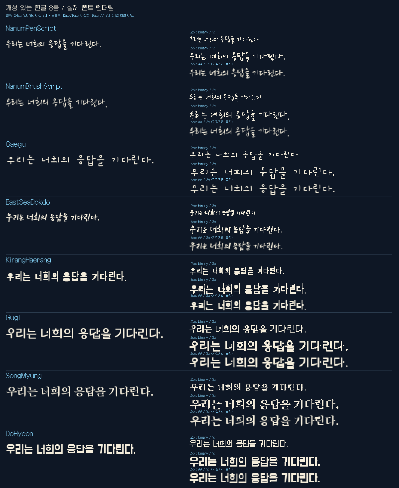

# 종족별 한글 폰트: 개성 중심 비교안

갈무리 변형만으로 종족을 구분하는 안은 보류했습니다. 기존 독립 픽셀 폰트 4종에 **손글씨·붓글씨·장식체 등 서로 다른 서체 8종**을 추가했습니다. 아래 배정은 모양과 분위기를 참고한 미확정 제안이며, 원작과의 유사성은 시각적 판단입니다.



## 비교 결과와 크기 제약

- 나눔손글씨 펜 / 붓: 자유로운 획과 흘림. 12px 이진화에서 획이 많이 끊어져 현 상태 그대로 적용하기 어렵습니다.
- 개구: 넓은 자간과 투박한 손글씨. 얇은 획 보존과 긴 대사의 줄바꿈 확인 필요.
- 동해독도: 거칠고 빠른 붓글씨. 원작 유사성보다 성격 차별화에 적합하며 작은 글자 판독은 추가 확인 필요.
- 기랑해랑: 불규칙하고 굵은 장식체. 비교 표본에서 작은 크기에도 개성이 잘 남습니다.
- 구기: 기하학적이고 기계적인 구조. 기계 종족 후보로 가장 뚜렷한 차이가 납니다.
- 송명: 부리가 있는 명조. 세리프 원본과 대응하기 좋지만 12px에서 일부 획이 뭉칩니다.
- 도현: 단단하고 굵은 간판체. 작은 표본의 가독성이 비교적 양호합니다.

아웃라인 서체의 12/16/24px는 **시험 크기이며 네이티브 픽셀 크기가 아닙니다**. 픽셀 폰트는 기존 지정 크기를 유지합니다. 이진화는 현 패치 방식과 같은 임계값 128, AA는 회색 가장자리를 유지한 별도 비교입니다. AA를 실제 게임에서 검증한 것은 아닙니다. 16px 표본의 잉크 높이는 글자에 따라 16px를 넘기도 하므로 원본 대화의 행간에 그대로 넣을 수 있다고 판단하면 안 됩니다.

오른쪽 고정 행 UI/로그는 Galmuri7, 현재 시험 대화/선택지는 기존 설정을 유지합니다. 적용 전 종족별 기준선·자막 높이·최장 문장·페이지 넘김·음성 구간을 확인해야 합니다. 현재 번역과 표본의 318문자 검사 통과는 전체 한글 지원이나 판독성 보장이 아닙니다.

## 원본 영문과 직접 비교하기

```powershell
python tools/render_expressive_fonts.py --game "게임 설치 디렉터리"
```

생성되는 `artifacts/font-review/index.html`에서 27개 대화 ID를 3장으로 비교합니다. 실제 게임의 영문 PNG 글리프를 원래 기준선과 글자 폭으로 조립하고 한글 후보와 동일한 3배 확대율로 보여줍니다. 원본 색상은 비교용 밝은 단색으로 통일합니다. 공통 표본 문장을 사용하며 게임 대사 번역은 아닙니다. 독립 폰트 리소스가 없는 3개 ID는 공유 관계 미확인으로 표시합니다. 원본 포함 비교 이미지는 Git에 넣지 않습니다.

`docs/expressive-fonts.png`는 원본 게임 자산을 포함하지 않는 한글만의 공개 표본입니다. 구체적인 고정 버전·제작자·라이선스·SHA-256은 [출처](../THIRD_PARTY.md) 및 `fonts.ko.json`을 참조하세요.

## 종족별 비교 후보

현재 적용 값과 후보를 구분합니다. 이름은 용어집의 검토 중 표기이며 승인된 번역이라는 뜻이 아닙니다.

| 대화 ID | 후보 | 현재 한글 적용 | 선택 이유 |
|---|---|---|---|
| arilou | NanumPenScript | 미적용 | 가느다란 원본의 가벼운 인상을 펜 손글씨로 재해석 |
| chmmr | Gugi | 미적용 | 각진 원본에 기하학적이고 기계적인 한글 구조 대응 |
| commander | Galmuri9 | Galmuri9 | 사람/기지 대화는 현재 검증 중인 중립 글꼴 유지. |
| druuge | DoHyeon | 미적용 | 넓고 단단한 원본에 간판 같은 굵은 획 대응 |
| ilwrath | SongMyung | 미적용 | 원본의 뾰족한 세리프를 명조의 부리로 대응 |
| kohrah | DoHyeon | 미적용 | 무거운 각진 원본에 굵은 구조 대응 |
| melnorme | DenkiChipHangul | 미적용 | 넓은 기하학 원본을 작은 픽셀 가독성으로 재해석 |
| mycon | KirangHaerang | 미적용 | 정방형 원본과 닮기보다는 불규칙한 유기적 인상 우선 |
| orz | KirangHaerang | 미적용 | 불규칙한 글자 형태로 이질적 개성 부여 |
| pkunk | NanumBrushScript | 미적용 | 흘려쓴 영문에 붓 손글씨의 흐름 대응 |
| probe | Gugi | 미적용 | 기하학적 구조로 기계 통신 표현 |
| safeones | Gaegu | 미적용 | 스파시와 동일한 검토 후보 |
| shofixti | EastSeaDokdo | 미적용 | 기울어진 원본의 속도감을 거친 붓 획으로 재해석 |
| slylandro | Mulmaru | 미적용 | 굵은 원본의 양감 유지, 기울기는 재현하지 않음 |
| spathi | Gaegu | 미적용 | 좁은 원본과의 유사성보다 소심하고 익살스러운 손글씨 인상 우선 |
| starbase | Galmuri9 | 미적용 | 사람/기지 대화는 현재 검증 중인 중립 글꼴 유지. |
| supox | NanumPenScript | 미적용 | 가늘고 뾰족한 원본을 가벼운 펜 획으로 재해석 |
| syreen | SongMyung | 미적용 | 장식적인 원본의 세리프를 명조 부리로 대응 |
| talkingpet | Gugi | 미적용 | 넓은 기하학 원본과 기하학 한글의 구조 비교 |
| thraddash | EastSeaDokdo | 미적용 | 원본 모양의 유사성보다 거친 붓 질감 우선 |
| umgah | KirangHaerang | 미적용 | 괴상하고 울퉁불퉁한 장식체로 개성 우선 |
| urquan | DoHyeon | Galmuri9 | 원본의 굵고 단단한 인상을 유지하는 후보 |
| utwig | SongMyung | 미적용 | 원본의 세로감과 의식적인 분위기 재해석; 폭은 다름 |
| vux | NanumBrushScript | 미적용 | 흘림과 기울기가 있는 원본을 붓글씨로 재해석 |
| yehat | EastSeaDokdo | 미적용 | 강한 기울기의 원본을 빠르고 굵은 붓 획으로 재해석 |
| yehat.rebel | EastSeaDokdo | 미적용 | 예하트와 동일한 검토 후보 |
| zoqfotpik | Gaegu | 미적용 | 가느다란 원본을 편안한 손글씨로 재해석 |

## 헤이스 반투명 시험 설치 (2026-09-25)

기본 빌드는 유지하고 `tools/trial_commander_font.py install --game "게임 경로" --render alpha`로 헤이스 한글 자막만 도현 12px로 바꾸는 별도 시험입니다. 실제 잉크 최대 11px, PNG 높이 14px이며 256단계 알파를 포함합니다. 같은 명령의 `--render binary`는 동일한 글꼴/치수에서 알파만 0/255로 바꾸는 비교군입니다. 플레이어 선택지, 우르콴, 공통 UI, 원문/음성 매핑은 기존과 같습니다. 원본 특수문자도 보존합니다.

설치 전 게임을 종료해야 합니다. 이전 패키지/manifest는 artifacts/font-trial-backups에 자동 백업합니다. `python patcher.py install --game "게임 경로" --ui-font compact`로 기본 패치로 복귀합니다. 현재 상태는 시험 설치이며 실기 가독성·겹침 검증 대기입니다.

## 7픽셀 UI 반투명 시험 (2026-09-25)

사용자 실기 의견: 큰 대화 글꼴의 반투명 표현은 선호하지 않음. 헤이스 도현 시험을 종료하고 대화는 기본 Galmuri9로 복귀. 새 시험은 starcon/tiny 한글에만 적용합니다. Galmuri7은 원래 2단계 알파이므로 단순히 이진화를 제거해도 달라지지 않습니다. 대신 도현 아웃라인을 32px로 렌더링해 전체 한글 공통 기준선으로 6x7px 잉크에 비율 유지 축소하고 8x8 PNG에 넣습니다. 고정 행 간격과 글자 진행 폭은 기존과 같습니다. 이 비교는 글꼴도 바뀌므로 알파 효과만의 비교가 아닙니다.

`python tools/trial_ui_font.py install --game "게임 경로" --render alpha`로 설치합니다. 동일 치수 흑백 비교군은 `--render binary`. 원복은 기본 patcher.py install --ui-font compact. 이전 패키지를 자동 백업합니다. 실제 작은 UI 가독성은 검증 대기입니다.
