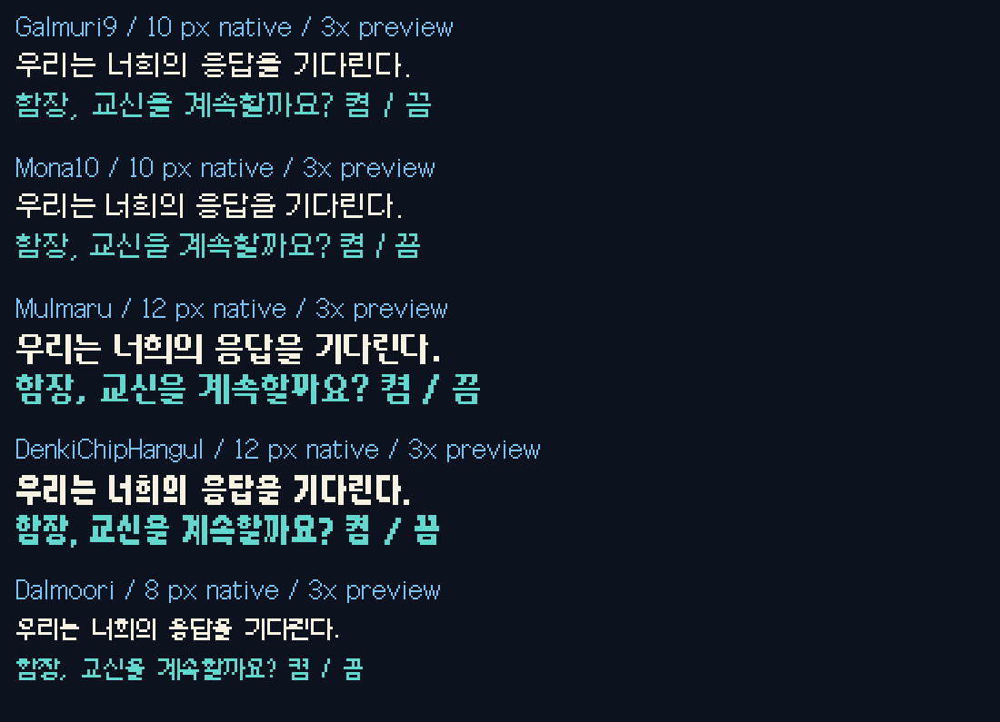

# 서로 다른 디자인의 종족별 폰트 후보

사용자 요청에 따라 갈무리 Bold/Condensed 중심의 이전 배정은 보류했습니다.
이제 **별도 제작 프로젝트의 모나·물마루·전기칩 한글·달무리**를 비교합니다. 갈무리9는 사람/선택지의 현재 기준 글꼴입니다.
모든 폰트가 완전히 독립적인 역사적 뿌리를 가진다고 주장하지 않습니다. 각 제작자의 참고/확장 관계는 출처를 확인하세요.
전기칩 한글은 일본어 전기칩 폰트의 한국어 확장이고, 다른 폰트들도 제작자가 명시한 참고 디자인이 있습니다.

## 후보와 제약

| 후보 | 원래 렌더링 크기 | 특징/검토 용도 | 라이선스 |
|---|---|---|---|
| Mona10 | 10px | 소형의 단정한 자막 | OFL 1.1 및 동봉 고지 |
| Mulmaru | 12px | 둥근 모서리, 굵은 세로획 | OFL 1.1 |
| DenkiChipHangul | 12px | 좁고 굵은 각진 자막 | OFL 1.1 |
| Dalmoori | 8px | 작은 촘촘한 디자인, 장문 판독 확인 필요 | Apache 2.0 |

크기는 파일 렌더링 크기이며 실제 잉크 높이와 다릅니다. 318자 검사에서 최대 글리프 bbox 높이는 모나9/물마루12/전기칩11/달무리9픽셀이었습니다.
따라서 오른쪽 메뉴와 로그의 고정 8px 행에는 이 후보를 전역 적용하지 않습니다. 기존 Galmuri7을 유지합니다.
이전 갈무리 Bold/Condensed 파일은 과거 비교 재현용으로 보관하며 새 후보에 포함하지 않습니다.

## 종족별 새 배정안

현재 설치 글꼴은 그대로입니다. 아래는 실제 표본을 보고 만든 **검토안**이며 사용자 확정/실기 적용 완료가 아닙니다.

| 대화 ID | 용어집 표기 | 새 후보 | 현재 한글 적용 |
|---|---|---|---|
| arilou | 아릴루 | Mona10 | 미적용 |
| chmmr | 촘르 | DenkiChipHangul | 미적용 |
| commander | 헤이스 | Galmuri9 | Galmuri9 |
| druuge | 드루지 | DenkiChipHangul | 미적용 |
| ilwrath | 일라스 | DenkiChipHangul | 미적용 |
| kohrah | 코르아 | DenkiChipHangul | 미적용 |
| melnorme | 멜노름 | Dalmoori | 미적용 |
| mycon | 마이콘 | Mulmaru | 미적용 |
| orz | 오르즈 | Mulmaru | 미적용 |
| pkunk | 프쿤크 | Mona10 | 미적용 |
| probe | 슬라이랜드로 탐사선 / 슬라이랜드로 | Dalmoori | 미적용 |
| safeones | 스파시 | Mulmaru | 미적용 |
| shofixti | 쇼픽스티 | Dalmoori | 미적용 |
| slylandro | 슬라이랜드로 | Mona10 | 미적용 |
| spathi | 스파시 | Mulmaru | 미적용 |
| starbase | 헤이스 | Galmuri9 | 미적용 |
| supox | 수폭스 | Mona10 | 미적용 |
| syreen | 시린 | Mona10 | 미적용 |
| talkingpet | 말하는 애완동물 | DenkiChipHangul | 미적용 |
| thraddash | 스래대시 | DenkiChipHangul | 미적용 |
| umgah | 움가 | Mulmaru | 미적용 |
| urquan | 우르콴 / 크저자 | DenkiChipHangul | Galmuri9 |
| utwig | 우트위그 | Mona10 | 미적용 |
| vux | VUX | Mona10 | 미적용 |
| yehat | 예하트 | Mulmaru | 미적용 |
| yehat.rebel | 예하트 | Mulmaru | 미적용 |
| zoqfotpik | 조크-포트-피크 | Mona10 | 미적용 |

## 검증과 적용

- 현재 UI·설정·시험 대사에 쓰인 한글 318자의 빈 글리프/누락 글리프 검사를 통과했습니다. 모든 한글 음절을 검사했다는 뜻은 아닙니다.
- 검사 결과: [font-candidate-checks.json](../docs/font-candidate-checks.json). 재검사: `python tools/check_font_candidates.py`.
- 폰트 원본과 라이선스는 vendor에 보관하고 파일·아카이브 해시와 버전을 기록했습니다. TTF는 수정하지 않았습니다.
- 새 후보는 게임 빌드에 아직 연결하지 않았습니다. 현재 대화 시험의 음성·세이브·설치 패키지는 변경하지 않았습니다.
- 다음 실기 비교 대상은 우르콴 자막에 전기칩 한글, 이후 다른 종족에 물마루/모나를 적용하는 순서입니다.
- 자막 폭/높이, 영문 함선 이름과의 기준선, 음성 구간, 긴 문장과 페이지 넘김을 검증한 뒤 배정을 확정합니다.
- safeones/starbase/yehat.rebel은 독립 FONTRES 선언이 없으므로 공유 글꼴 관계 확인 후 적용합니다.

[용어집](GLOSSARY.md) · [폰트 등록 정보](fonts.ko.json) · [전체 출처](../THIRD_PARTY.md)
