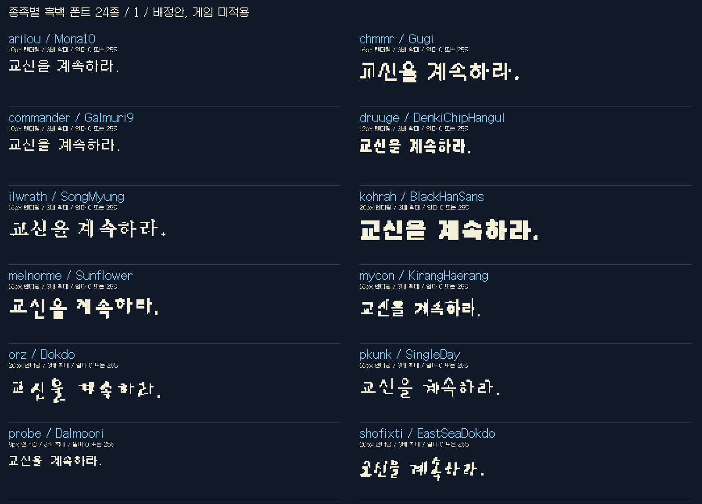
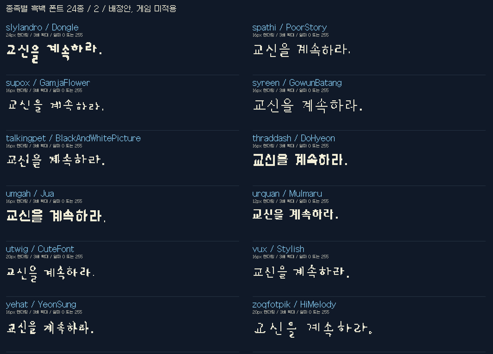

# 현재 설치 상태

사용자의 적용 요청에 따라 24개 종족별 폰트 연결을 설치했습니다. 27개 대화는 같은 종족의 공유 연결을 사용합니다. 원본 영문 글리프는 보존하며, 한국어 번역이 있는 부분에 선정한 서체가 표시됩니다. 현재 번역된 대화에 적용되며 종족별 진척은 docs/localization-progress.json에서 추적합니다. 원본 영문 대사까지 새로운 TTF의 영문 글자로 바꾼 것은 아닙니다. 모든 종족의 실기 레이아웃은 검증 대기입니다. 아래는 선정 당시의 비교 기록입니다.

# 종족별 흑백 한글 폰트 배정안

**확정된 사용자 방침: 반투명 글꼴을 사용하지 않습니다.** 글리프 알파는 0 또는 255입니다.

27개 대화 ID를 24개 그룹으로 묶고 **24개 서로 다른 디자인 계열·파일·SHA-256**을 배정했습니다. 같은 계열의 Bold/Condensed만 바꾸어 종족 수를 채우지 않았습니다. 이는 제작 측의 배정안이며 사용자 최종 승인, 모든 종족 게임 설치, 전체 대사 검증 완료를 뜻하지 않습니다. 서로 다른 파일이어도 낮은 해상도에서는 비슷하게 보일 수 있습니다.

- 추가 확보: 독립 한글 서체 15종. 이 중 고운돋움은 예비 후보이며 이번 24종에는 미배정.
- 공유: safeones → spathi, starbase → commander, yehat.rebel → yehat. 이는 한국어 디자인 그룹이며 원본 리소스 공유 경로 확인 완료라는 뜻은 아닙니다.
- 작은 흑백에서 획 손실이 심했던 나눔손글씨 펜/붓·개구체는 이번 배정에서 제외했습니다.
- 공통 UI/로그는 Galmuri7, 선택지는 Galmuri9를 사용합니다. 종족 자막은 아래 배정표를 따릅니다.

## 비교 이미지




표본은 한글 글자를 개별 래스터화하고 글리프 폭에 1픽셀 간격을 더해 조립했습니다. 동일한 공통 기준선과 3배 최근접 확대를 사용하며, 게임 화면 캡처가 아닙니다. 아웃라인 서체의 16~24px는 시험 렌더링 크기이고 실제 잉크 높이와 다릅니다. 픽셀 서체는 지정된 원래 크기를 유지합니다. 큰 서체를 현재 7픽셀 UI에 넣는 제안이 아닙니다.

## 그룹별 배정

용어집 표기는 현재 검토 중인 이름을 그대로 참조합니다. 이름의 승인 상태를 변경하지 않았습니다.

| 그룹 | 용어집 표기 | 후보 파일 계열 | 렌더링 px | 검토 사항 |
|---|---|---|---|---|
| arilou | 아릴루 | Mona10 | 10 | 짧은 표본 확인; 실제 긴 대사/줄바꿈/색상별 가독성 미검증 |
| chmmr | 촘르 | Gugi | 16 | 짧은 표본 확인; 실제 긴 대사/줄바꿈/색상별 가독성 미검증 |
| commander | 헤이스 | Galmuri9 | 10 | 짧은 표본 확인; 실제 긴 대사/줄바꿈/색상별 가독성 미검증 |
| druuge | 드루지 | DenkiChipHangul | 12 | 짧은 표본 확인; 실제 긴 대사/줄바꿈/색상별 가독성 미검증 |
| ilwrath | 일라스 | SongMyung | 16 | 얇은 획/장식 일부 손실; 긴 대사 판독 및 레이아웃 재검증 필요 |
| kohrah | 코르아 | BlackHanSans | 20 | 큰 크기에서만 검토; 실제 자막 영역/행 수 재검증 필요 |
| melnorme | 멜노름 | Sunflower | 16 | 짧은 표본 확인; 실제 긴 대사/줄바꿈/색상별 가독성 미검증 |
| mycon | 마이콘 | KirangHaerang | 16 | 짧은 표본 확인; 실제 긴 대사/줄바꿈/색상별 가독성 미검증 |
| orz | 오르즈 | Dokdo | 20 | 큰 크기에서만 검토; 실제 자막 영역/행 수 재검증 필요 |
| pkunk | 프쿤크 | SingleDay | 16 | 얇은 획/장식 일부 손실; 긴 대사 판독 및 레이아웃 재검증 필요 |
| probe | 슬라이랜드로 탐사선 / 슬라이랜드로 | Dalmoori | 8 | 짧은 표본 확인; 실제 긴 대사/줄바꿈/색상별 가독성 미검증 |
| shofixti | 쇼픽스티 | EastSeaDokdo | 20 | 큰 크기에서만 검토; 실제 자막 영역/행 수 재검증 필요 |
| slylandro | 슬라이랜드로 | Dongle | 24 | 큰 크기에서만 검토; 실제 자막 영역/행 수 재검증 필요 |
| spathi | 스파시 | PoorStory | 16 | 얇은 획/장식 일부 손실; 긴 대사 판독 및 레이아웃 재검증 필요 |
| supox | 수폭스 | GamjaFlower | 16 | 얇은 획/장식 일부 손실; 긴 대사 판독 및 레이아웃 재검증 필요 |
| syreen | 시린 | GowunBatang | 16 | 얇은 획/장식 일부 손실; 긴 대사 판독 및 레이아웃 재검증 필요 |
| talkingpet | 말하는 애완동물 | BlackAndWhitePicture | 16 | 얇은 획/장식 일부 손실; 긴 대사 판독 및 레이아웃 재검증 필요 |
| thraddash | 스래대시 | DoHyeon | 16 | 짧은 표본 확인; 실제 긴 대사/줄바꿈/색상별 가독성 미검증 |
| umgah | 움가 | Jua | 16 | 짧은 표본 확인; 실제 긴 대사/줄바꿈/색상별 가독성 미검증 |
| urquan | 우르콴 / 크저자 | Mulmaru | 12 | 짧은 표본 확인; 실제 긴 대사/줄바꿈/색상별 가독성 미검증 |
| utwig | 우트위그 | CuteFont | 20 | 큰 크기에서만 검토; 실제 자막 영역/행 수 재검증 필요 |
| vux | VUX | Stylish | 16 | 얇은 획/장식 일부 손실; 긴 대사 판독 및 레이아웃 재검증 필요 |
| yehat | 예하트 | YeonSung | 16 | 얇은 획/장식 일부 손실; 긴 대사 판독 및 레이아웃 재검증 필요 |
| zoqfotpik | 조크-포트-피크 | HiMelody | 20 | 얇은 획/장식 일부 손실; 긴 대사 판독 및 레이아웃 재검증 필요 |

## 판단과 남은 검증

구기·기랑해랑·전기칩·물마루·주아는 짧은 표본에서 구조 차이가 비교적 뚜렷합니다. 검은고딕은 무게감이 강하지만 작은 크기에서 속공간이 뭉칩니다. 손글씨·붓글씨는 종족 개성에 유리하지만 일부 획이 끊기거나 합쳐지며 장문 가독성은 아직 보장하지 못합니다. 이 때문에 모든 후보를 바로 게임에 전역 적용하지 않았습니다.

검사 범위는 현재 번역과 표본의 문자 지원, 이진화 후 빈 글자 여부, 알파 값 0/255, 그룹별 가족/파일/해시 중복, 비교 이미지의 가로 잘림입니다. 전체 한글 11,172자 또는 아직 번역하지 않은 대사의 지원 여부를 검증한 것은 아닙니다. `docs/binary-font-checks.json`의 크기와 검증 상태를 참조하세요.

실기 적용 전에는 종족별 최대 자막 폭·높이, 실제 행간, 가장 긴 대사, 문장 줄바꿈, 페이지 넘김, 음성 구간을 확인해야 합니다. 글꼴이 서로 다르다는 조건과 작은 화면에서 잘 읽힌다는 조건은 별도입니다. 표본 크기를 줄이면 개성이 사라지는 후보는 재선정 대상입니다.

## 원본 영문과 비교 / 재생성

```powershell
python tools/check_font_candidates.py
python tools/review_binary_fonts.py --game "게임 설치 디렉터리"
```

`artifacts/binary-font-review/index.html`에 원본 영문 PNG와 한글을 나란히 놓은 27개 대화 비교가 생성됩니다. 원본 포함 결과는 Git에서 제외하며 위 공개 표본에는 게임 자산이 없습니다. 폰트의 공식 출처·라이선스·고정 버전·해시는 [THIRD_PARTY.md](../THIRD_PARTY.md)와 `fonts.ko.json`에 기록합니다.

## 종료한 시험

헤이스 도현 반투명 시험과 7픽셀 UI 반투명 시험은 사용자 실기 평가로 모두 종료했습니다. 기본 패치로 복원했고 반투명 시험 설치는 차단했습니다. `render_expressive_fonts.py`와 기존 AA 표본은 과거 실험 재현용이며 현재 선정 기준은 이 문서의 흑백 표본입니다.

## 탐사 보고 전용 폰트

font.lander에 Galmuri9 10px(10x9 잉크, 10x12 PNG)을 별도 연결했습니다. 한글은 가로 두 칸을 쓰고 첫 행·교대 행·페이지 안내 행을 확보합니다. 원본 영문 글리프는 보존합니다. 종족별 24종 배정 수에는 포함하지 않는 공통 보고용 글꼴입니다. [배치 원리와 검증 한계](../docs/REPORT_LAYOUT.md). 실기 검토 대기입니다.

소개 슬라이드: 원본 starcon/slides ASCII를 보존하고 애드온의 starcon에는 기존 Galmuri7, slides에는 player 글꼴과 같은 Galmuri9 10px 래스터(9px 잉크/12px PNG)의 이진 알파 한글을 연결한다. 24개 종족 폰트 배정은 그대로다. 정적 폭 검사 및 실제 소개 재생 확인은 구분한다.

최종 엔딩도 소개의 slides 글꼴을 공유한다. Galmuri9 흑백 한글과 원본 영문 글리프를 유지하며 새 외부 폰트는 추가하지 않는다.

## 크레딧 공통 폰트

credits.font.pt13: 기존 Galmuri11의 native 12 래스터(잉크 11), pt17: Galmuri9 native 10을 최근접 2배(잉크 18), pt45: Galmuri11 native 12를 최근접 4배(잉크 44). 원본 PNG 높이 17/24/57과 영문 글리프를 유지하고 한글 알파는 0/255만 쓴다. 종족 24종 배정은 변경하지 않는다. 실기 스크롤 확인 대기.
